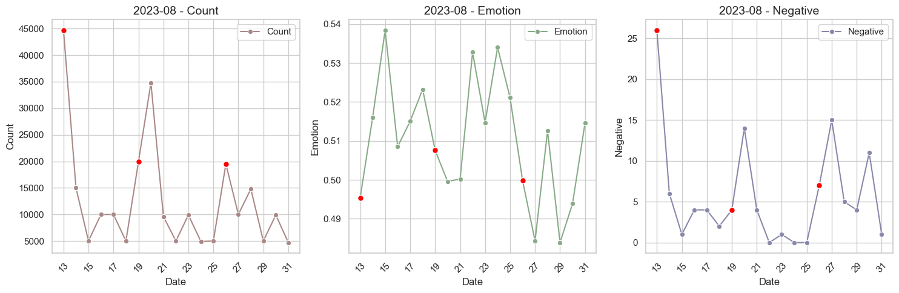

# 프로젝트 제목: SONNY Wave

## 프로젝트 소개
이 프로젝트는 해외축구 갤러리의 게시글 데이터를 분석하여 축구 팬들의 감정 변화를 시각화하고, 손흥민 선수의 경기 성적이 팬들의 감정에 어떤 영향을 미치는지 탐구합니다. 본 프로젝트를 통해 축구 경기와 관련된 사회적 감정의 흐름을 이해하고, 특정 선수의 성적이 팬들의 감정 변화에 미치는 영향을 분석합니다.

## 기능
- **데이터 크롤링**: 해외축구 갤러리의 게시글 데이터를 자동으로 수집합니다.
- **감정 분석**: 수집된 데이터를 바탕으로 감정 분석을 수행하고, 감정 지수를 산출합니다.
- **데이터 시각화**: 일별 및 월별 팬들의 감정 변화를 그래프로 시각화합니다. 손흥민 선수의 경기 일정을 그래프에 표시하여, 그의 성적과 팬들의 감정 변화 사이의 관계를 시각적으로 탐구합니다.

## 시작하기
이 섹션에서는 프로젝트를 시작하기 위한 사전 요구 사항과 설치 방법을 안내합니다.

### 사전 요구 사항
본 프로젝트는 Python 3.6 이상이 필요하며, 다음과 같은 Python 라이브러리에 의존합니다:
- Selenium
- BeautifulSoup
- Pandas
- Matplotlib
- Seaborn

### 설치 방법
   ```
   git clone https://github.com/20161609/Sonny-Wave.git
   ```

## 사용 방법
본 프로젝트는 데이터 수집, 처리, 분석 및 시각화의 전 과정을 단계별로 나누어 구성하였습니다. 각 단계는 Jupyter Notebook(.ipynb) 파일로 제공되며, 사용자는 각 파일을 순서대로 실행함으로써 프로젝트의 전체 과정을 손쉽게 따라갈 수 있습니다.

프로젝트의 각 단계를 실행하기 위해, Jupyter Notebook에서 제공하는 "Run All" 기능을 활용할 수 있습니다. 이 기능은 현재 열린 노트북의 모든 셀을 처음부터 끝까지 자동으로 실행시켜 줍니다. 각 단계별로 다음의 파일을 열고, "Run All"을 선택하여 전체 과정을 실행하세요.

1. **데이터 크롤링 (`step1_crawling.ipynb`)**: 이 단계에서는 해외축구 갤러리의 게시글 데이터를 자동으로 수집합니다. 노트북을 열고, 상단 메뉴에서 `Cell` > `Run All`을 선택하여 모든 셀을 실행합니다.
   
2. **데이터 처리 및 감정 분석 (`step2_nlp_analysis.ipynb`)**: 수집된 데이터를 바탕으로 감정 분석을 수행하고 감정 지수를 산출합니다. 마찬가지로, `Run All` 기능을 사용하여 노트북의 모든 셀을 실행합니다.
   
3. **데이터 시각화 (`step3_viewer.ipynb`)**: 마지막 단계에서는 분석된 데이터를 바탕으로 감정 변화를 시각화합니다. 이 단계에서도 `Run All`을 통해 시각화 과정을 자동으로 실행할 수 있습니다.

## 결과 예시


## 사용된 외부 코드
이 프로젝트는 다음의 외부 소스 코드를 사용하였습니다:
- https://github.com/e9t/nsmc - 감정 분석 모델을 훈련시킬 데이터로 영화 리뷰 데이터를 활용했습니다. 
- (https://colab.research.google.com/drive/1PkuR9r9WrAXHBq3TLePCiOEgYwuFx2lO?usp=sharing) - 원본 코드는 [wonhwa.tistory.com](https://wonhwa.tistory.com/35)에서 찾을 수 있습니다. 이 코드는 해외축구갤러리 게시글 감정분석 작업에 사용되었습니다.
- 변경 사항: 원본 코드에 적힌 모델 구성요소는 그대로 사용하였습니다. 해당 예측 모델을 게시글 분석에 사용했습니다.

---